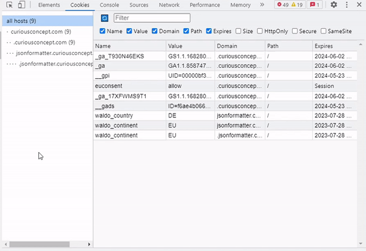
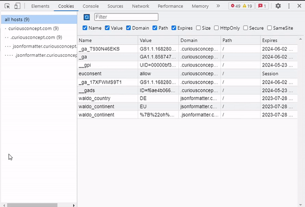
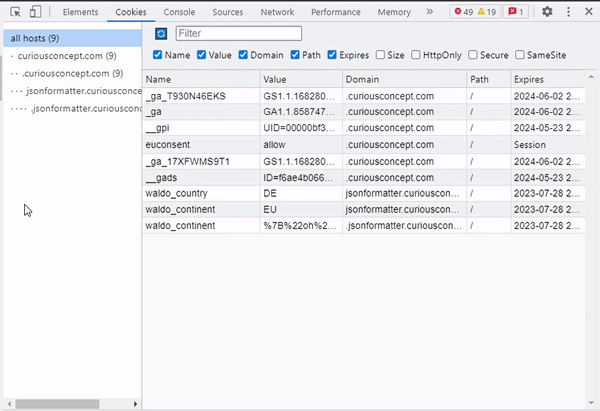

# Chrome Cookies Extension
A nicer way of dealing with cookies in Chrome.

Use this Cookies Extension to get the best of dev-tools experience 💻 Edit, create, delete cookies easily 🍪

It is designed to be consistent with the existing cookies panel of the dev-tools. BUT It has better features and smoother UX 😎

Advantages of the Cookies Extension:

✔️ Cookie value is **decoded** and easily **editable** with Cookie Editor! No more raw encoded value editing. Edit the value you **really** have. **JSON is JSON** and not something like %2C%0WTF.

✔️ Flexible **columns width**. Columns are so dense in the default panel... Here you choose the width you need.

✔️ Columns visibility control. Do you **really** need all the columns to be visible in this smaaaall table? I don't think so, at least I've never needed. So now you can **hide useless columns**.

✔️ Comprehensive hosts/domains tree. Sometimes you work with websites which have a huge pile of cookie from different domain. Wouldn't it be more effective to choose the **domain/host you need**? Yes, it would.

I believe it can be a perfect tool in your everyday work and a beautiful complement to your dev-tools panels.

This Cookie Extension doesn't send or share your cookies. Your privacy is sacred.

## Features examples

### Editable Decoded Value & Cookie Editor

### Flexible Columns/Areas Sizes

### Columns Visibility Control

## Contributing

1. Pull the project
2. Install with `npm install`
3. Run `npm run watch` to enable the watcher
4. Add the project directory as an Unpacked Extension to your Chrome instance [as per docs](https://developer.chrome.com/docs/extensions/mv3/getstarted/development-basics/#load-unpacked)
5. Enjoy!
6. Check your code with Eslint before pushing `npm run cs`

## Known Limitations
- `Secure` is not updatable - this is a limitation in the native Chrome's cookie manager. It's likely dictated by the fact that you cannot change Secure without changing the host from `https` to `http`.
- SameSite cannot be set to None - don't know why, but you can't do it even in the native Chrome's cookies panel.
